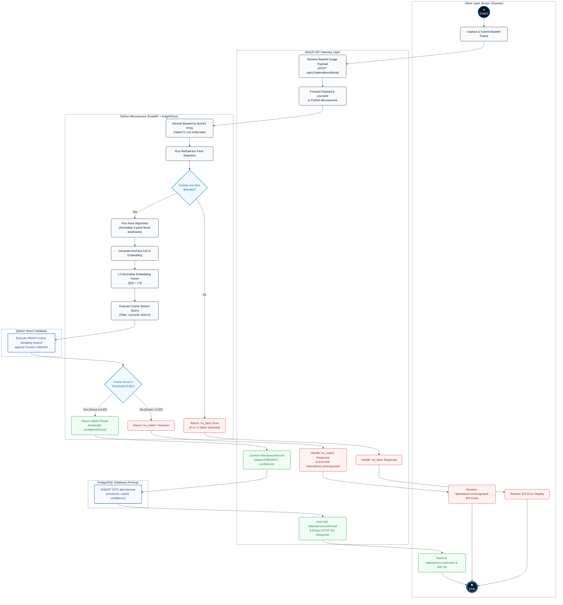

```mermaid
flowchart TD
    %% =========================================================================
    %% SWIMLANES (PARTITIONED ARCHITECTURAL RESPONSIBILITY)
    %% =========================================================================

    subgraph CLIENT ["Client Layer (Kiosk / Browser)"]
        START((●<br/>START))
        SEND_IMG["Capture & Submit Base64 Frame"]
        RECV_422["Receive 422 Error Display"]
        RECV_UNREC["Receive 'attendance:unrecognised' WS Event"]
        RECV_SUCCESS["Receive 'attendance:confirmed' & 200 OK"]
        END_NODE(((◉<br/>END)))
    end

    subgraph NESTJS ["NestJS API Gateway Layer"]
        RECV_B64["Receive Base64 Image Payload<br/><i>(POST /api/v1/attendance/facial)</i>"]
        FWD_PY["Forward Payload & courseId<br/>to Python Microservice"]
        HANDLE_ERR_NOFACE["Handle 'no_face' Response"]
        HANDLE_ERR_NOMATCH["Handle 'no_match' Response<br/>& Emit WS 'attendance:unrecognised'"]
        CREATE_RECORD["Commit AttendanceRecord<br/>(status=PRESENT, confidence)"]
        EMIT_CONFIRM["Emit WS 'attendance:confirmed'<br/>& Return HTTP 201 Response"]
    end

    subgraph PYTHON_SERVICE ["Python Microservice (FastAPI + InsightFace)"]
        DECODE_IMG["Decode Base64 to NumPy Array<br/><i>(OpenCV cv2.imdecode)</i>"]
        RETINAFACE["Run RetinaFace Face Detection"]
        DEC_ONE_FACE{"Exactly one face<br/>detected?"}
        RET_ERR_NOFACE["Return 'no_face' Error<br/><i>(0 or >1 faces detected)</i>"]
        ALIGN_FACE["Run Face Alignment<br/><i>(Normalise 5-point facial landmarks)</i>"]
        GEN_EMBED["Generate ArcFace 512-d Embedding"]
        NORM_EMBED["L2-Normalise Embedding Vector<br/><i>(||v|| = 1.0)</i>"]
        SEND_QDRANT["Execute Cosine Search Query<br/><i>(Filter: courseId, limit=1)</i>"]
        DEC_THRESHOLD{"Cosine Score &ge;<br/>Threshold (0.65)?"}
        RET_ERR_NOMATCH["Return 'no_match' Outcome"]
        RET_MATCH["Return Match Result<br/><i>{studentId, confidenceScore}</i>"]
    end

    subgraph VECTOR_DB ["Qdrant Vector Database"]
        QDRANT_SEARCH["Execute HNSW Cosine Similarity Search<br/>against Course Collection"]
    end

    subgraph RELATIONAL_DB ["PostgreSQL Database (Prisma)"]
        INSERT_PG["INSERT INTO attendances<br/><i>(sessionId, userId, confidence)</i>"]
    end

    %% =========================================================================
    %% ACTIVITY SEQUENTIAL FLOW
    %% =========================================================================

    %% Initiation
    START --> SEND_IMG
    SEND_IMG --> RECV_B64
    RECV_B64 --> FWD_PY
    FWD_PY --> DECODE_IMG
    DECODE_IMG --> RETINAFACE
    RETINAFACE --> DEC_ONE_FACE

    %% Decision 1: Single Face Verification
    DEC_ONE_FACE -->|"No"| RET_ERR_NOFACE
    RET_ERR_NOFACE --> HANDLE_ERR_NOFACE
    HANDLE_ERR_NOFACE --> RECV_422
    RECV_422 --> END_NODE

    DEC_ONE_FACE -->|"Yes"| ALIGN_FACE
    ALIGN_FACE --> GEN_EMBED
    GEN_EMBED --> NORM_EMBED
    NORM_EMBED --> SEND_QDRANT

    %% Qdrant Query
    SEND_QDRANT --> QDRANT_SEARCH
    QDRANT_SEARCH --> DEC_THRESHOLD

    %% Decision 2: Confidence Threshold Check
    DEC_THRESHOLD -->|"No (Score < 0.65)"| RET_ERR_NOMATCH
    RET_ERR_NOMATCH --> HANDLE_ERR_NOMATCH
    HANDLE_ERR_NOMATCH --> RECV_UNREC
    RECV_UNREC --> END_NODE

    DEC_THRESHOLD -->|"Yes (Score &ge; 0.65)"| RET_MATCH
    RET_MATCH --> CREATE_RECORD
    CREATE_RECORD --> INSERT_PG
    INSERT_PG --> EMIT_CONFIRM
    EMIT_CONFIRM --> RECV_SUCCESS
    RECV_SUCCESS --> END_NODE

    %% =========================================================================
    %% ACADEMIC TWO-TONE STYLING
    %% =========================================================================
    classDef startEndStyle fill:#0f172a,stroke:#38bdf8,stroke-width:2px,color:#ffffff;
    classDef processStyle fill:#f8fafc,stroke:#334155,stroke-width:1.5px,color:#0f172a,rx:6px,ry:6px;
    classDef decisionStyle fill:#f0f9ff,stroke:#0284c7,stroke-width:2px,color:#0369a1;
    classDef dbStyle fill:#f8fafc,stroke:#2563eb,stroke-width:2px,color:#1e40af,rx:4px,ry:4px;
    classDef errStyle fill:#fef2f2,stroke:#ef4444,stroke-width:1.5px,color:#991b1b,rx:6px,ry:6px;
    classDef successStyle fill:#f0fdf4,stroke:#16a34a,stroke-width:1.5px,color:#15803d,rx:6px,ry:6px;
    classDef laneStyle fill:#ffffff,stroke:#94a3b8,stroke-width:1.5px,color:#0f172a;

    class START,END_NODE startEndStyle;
    class SEND_IMG,RECV_B64,FWD_PY,DECODE_IMG,RETINAFACE,ALIGN_FACE,GEN_EMBED,NORM_EMBED,SEND_QDRANT processStyle;
    class DEC_ONE_FACE,DEC_THRESHOLD decisionStyle;
    class QDRANT_SEARCH,INSERT_PG dbStyle;
    class RET_ERR_NOFACE,HANDLE_ERR_NOFACE,RECV_422,RET_ERR_NOMATCH,HANDLE_ERR_NOMATCH,RECV_UNREC errStyle;
    class CREATE_RECORD,EMIT_CONFIRM,RECV_SUCCESS,RET_MATCH successStyle;
    class CLIENT,NESTJS,PYTHON_SERVICE,VECTOR_DB,RELATIONAL_DB laneStyle;
```
