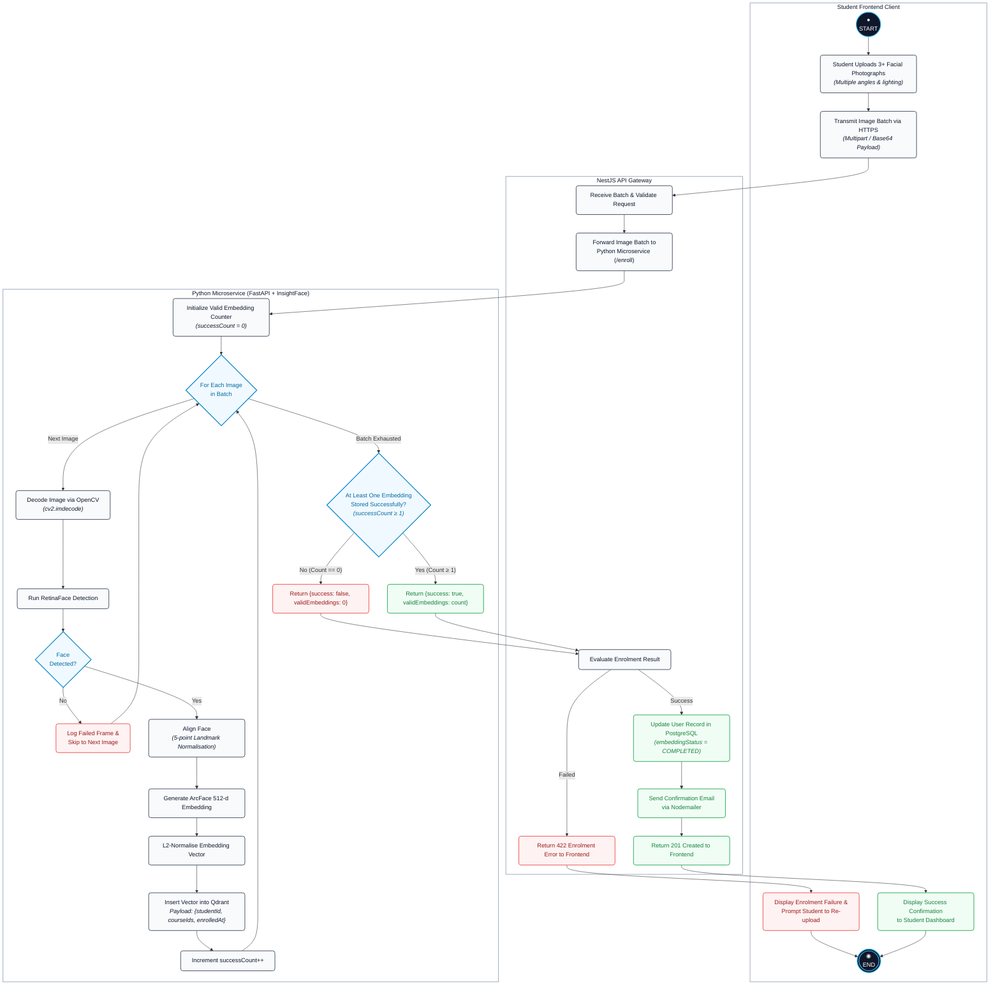

```mermaid
flowchart TD
    %% =========================================================================
    %% SWIMLANES / ARCHITECTURAL DOMAINS
    %% =========================================================================

    subgraph CLIENT ["Student Frontend Client"]
        START((●<br/>START))
        UPLOAD_PICS["Student Uploads 3+ Facial Photographs<br/><i>(Multiple angles & lighting)</i>"]
        TRANSMIT_HTTPS["Transmit Image Batch via HTTPS<br/><i>(Multipart / Base64 Payload)</i>"]
        RECV_FAIL["Display Enrolment Failure &<br/>Prompt Student to Re-upload"]
        DISP_SUCCESS["Display Success Confirmation<br/>to Student Dashboard"]
        END_NODE(((◉<br/>END)))
    end

    subgraph NESTJS ["NestJS API Gateway"]
        RECV_BATCH["Receive Batch & Validate Request"]
        FWD_PY["Forward Image Batch to<br/>Python Microservice (/enroll)"]
        CHECK_OUTCOME["Evaluate Enrolment Result"]
        UPDATE_DB["Update User Record in PostgreSQL<br/><i>(embeddingStatus = COMPLETED)</i>"]
        SEND_EMAIL["Send Confirmation Email<br/>via Nodemailer"]
        RET_201["Return 201 Created to Frontend"]
        RET_422["Return 422 Enrolment Error to Frontend"]
    end

    subgraph PYTHON_SERVICE ["Python Microservice (FastAPI + InsightFace)"]
        INIT_COUNTER["Initialize Valid Embedding Counter<br/><i>(successCount = 0)</i>"]
        LOOP_START{"For Each Image<br/>in Batch"}
        DECODE_IMG["Decode Image via OpenCV<br/><i>(cv2.imdecode)</i>"]
        RUN_RETINAFACE["Run RetinaFace Detection"]
        DEC_FACE_DETECTED{"Face<br/>Detected?"}
        LOG_FAIL["Log Failed Frame &<br/>Skip to Next Image"]
        ALIGN_FACE["Align Face<br/><i>(5-point Landmark Normalisation)</i>"]
        GEN_EMBED["Generate ArcFace 512-d Embedding"]
        NORM_EMBED["L2-Normalise Embedding Vector"]
        INSERT_QDRANT["Insert Vector into Qdrant<br/><i>Payload: {studentId, courseIds, enrolledAt}</i>"]
        INC_COUNTER["Increment successCount++"]
        DEC_MIN_STORED{"At Least One Embedding<br/>Stored Successfully?<br/><i>(successCount &ge; 1)</i>"}
        RET_PY_FAIL["Return {success: false, validEmbeddings: 0}"]
        RET_PY_SUCCESS["Return {success: true, validEmbeddings: count}"]
    end

    %% =========================================================================
    %% CONTROL FLOW
    %% =========================================================================

    %% Upload & Ingress
    START --> UPLOAD_PICS
    UPLOAD_PICS --> TRANSMIT_HTTPS
    TRANSMIT_HTTPS --> RECV_BATCH
    RECV_BATCH --> FWD_PY
    FWD_PY --> INIT_COUNTER
    INIT_COUNTER --> LOOP_START

    %% Batch Processing Loop
    LOOP_START -->|"Next Image"| DECODE_IMG
    DECODE_IMG --> RUN_RETINAFACE
    RUN_RETINAFACE --> DEC_FACE_DETECTED

    DEC_FACE_DETECTED -->|"No"| LOG_FAIL
    LOG_FAIL --> LOOP_START

    DEC_FACE_DETECTED -->|"Yes"| ALIGN_FACE
    ALIGN_FACE --> GEN_EMBED
    GEN_EMBED --> NORM_EMBED
    NORM_EMBED --> INSERT_QDRANT
    INSERT_QDRANT --> INC_COUNTER
    INC_COUNTER --> LOOP_START

    %% Post-Loop Evaluation
    LOOP_START -->|"Batch Exhausted"| DEC_MIN_STORED

    %% Failure Path
    DEC_MIN_STORED -->|"No (Count == 0)"| RET_PY_FAIL
    RET_PY_FAIL --> CHECK_OUTCOME
    CHECK_OUTCOME -->|"Failed"| RET_422
    RET_422 --> RECV_FAIL
    RECV_FAIL --> END_NODE

    %% Success Path
    DEC_MIN_STORED -->|"Yes (Count &ge; 1)"| RET_PY_SUCCESS
    RET_PY_SUCCESS --> CHECK_OUTCOME
    CHECK_OUTCOME -->|"Success"| UPDATE_DB
    UPDATE_DB --> SEND_EMAIL
    SEND_EMAIL --> RET_201
    RET_201 --> DISP_SUCCESS
    DISP_SUCCESS --> END_NODE

    %% =========================================================================
    %% ACADEMIC TWO-TONE STYLING
    %% =========================================================================
    classDef startEndStyle fill:#0f172a,stroke:#38bdf8,stroke-width:2px,color:#ffffff;
    classDef processStyle fill:#f8fafc,stroke:#334155,stroke-width:1.5px,color:#0f172a,rx:6px,ry:6px;
    classDef decisionStyle fill:#f0f9ff,stroke:#0284c7,stroke-width:2px,color:#0369a1;
    classDef errStyle fill:#fef2f2,stroke:#ef4444,stroke-width:1.5px,color:#991b1b,rx:6px,ry:6px;
    classDef successStyle fill:#f0fdf4,stroke:#16a34a,stroke-width:1.5px,color:#15803d,rx:6px,ry:6px;
    classDef laneStyle fill:#ffffff,stroke:#94a3b8,stroke-width:1.5px,color:#0f172a;

    class START,END_NODE startEndStyle;
    class UPLOAD_PICS,TRANSMIT_HTTPS,RECV_BATCH,FWD_PY,INIT_COUNTER,DECODE_IMG,RUN_RETINAFACE,ALIGN_FACE,GEN_EMBED,NORM_EMBED,INSERT_QDRANT,INC_COUNTER,CHECK_OUTCOME processStyle;
    class LOOP_START,DEC_FACE_DETECTED,DEC_MIN_STORED decisionStyle;
    class LOG_FAIL,RET_PY_FAIL,RET_422,RECV_FAIL errStyle;
    class RET_PY_SUCCESS,UPDATE_DB,SEND_EMAIL,RET_201,DISP_SUCCESS successStyle;
    class CLIENT,NESTJS,PYTHON_SERVICE laneStyle;
```
