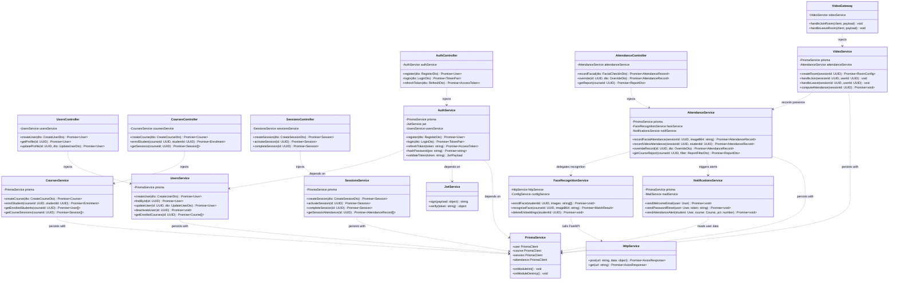

```mermaid
classDiagram
    direction TB

    %% =========================================================================
    %% CONTROLLER LAYER
    %% =========================================================================
    class AuthController {
        -AuthService authService
        +register(dto: RegisterDto) Promise~User~
        +login(dto: LoginDto) Promise~TokenPair~
        +refreshToken(dto: RefreshDto) Promise~AccessToken~
    }

    class UsersController {
        -UsersService usersService
        +createUser(dto: CreateUserDto) Promise~User~
        +getProfile(id: UUID) Promise~User~
        +updateProfile(id: UUID, dto: UpdateUserDto) Promise~User~
    }

    class CoursesController {
        -CoursesService coursesService
        +createCourse(dto: CreateCourseDto) Promise~Course~
        +enrolStudent(courseId: UUID, studentId: UUID) Promise~Enrolment~
        +getSessions(courseId: UUID) Promise~Session[]~
    }

    class SessionsController {
        -SessionsService sessionsService
        +createSession(dto: CreateSessionDto) Promise~Session~
        +activateSession(id: UUID) Promise~Session~
        +completeSession(id: UUID) Promise~Session~
    }

    class AttendanceController {
        -AttendanceService attendanceService
        +recordFacial(dto: FacialCheckInDto) Promise~AttendanceRecord~
        +override(id: UUID, dto: OverrideDto) Promise~AttendanceRecord~
        +getReport(courseId: UUID) Promise~ReportDto~
    }

    class VideoGateway {
        -VideoService videoService
        +handleJoinRoom(client, payload) void
        +handleLeaveRoom(client, payload) void
    }

    %% =========================================================================
    %% SERVICE LAYER
    %% =========================================================================
    class AuthService {
        -PrismaService prisma
        -JwtService jwt
        -UsersService usersService
        +register(dto: RegisterDto) Promise~User~
        +login(dto: LoginDto) Promise~TokenPair~
        +refreshToken(token: string) Promise~AccessToken~
        +hashPassword(pw: string) Promise~string~
        +validateToken(token: string) JwtPayload
    }

    class UsersService {
        -PrismaService prisma
        +createUser(dto: CreateUserDto) Promise~User~
        +findById(id: UUID) Promise~User~
        +updateUser(id: UUID, dto: UpdateUserDto) Promise~User~
        +deactivateUser(id: UUID) Promise~void~
        +getEnrolledCourses(id: UUID) Promise~Course[]~
    }

    class CoursesService {
        -PrismaService prisma
        +createCourse(dto: CreateCourseDto) Promise~Course~
        +enrolStudent(courseId: UUID, studentId: UUID) Promise~Enrolment~
        +getEnrolledStudents(courseId: UUID) Promise~User[]~
        +getCourseSessions(courseId: UUID) Promise~Session[]~
    }

    class SessionsService {
        -PrismaService prisma
        +createSession(dto: CreateSessionDto) Promise~Session~
        +activateSession(id: UUID) Promise~Session~
        +completeSession(id: UUID) Promise~Session~
        +getSessionAttendance(id: UUID) Promise~AttendanceRecord[]~
    }

    class AttendanceService {
        -PrismaService prisma
        -FaceRecognitionService faceService
        -NotificationsService notifService
        +recordFacialAttendance(sessionId: UUID, imageB64: string) Promise~AttendanceRecord~
        +recordVideoAttendance(sessionId: UUID, studentId: UUID) Promise~AttendanceRecord~
        +overrideRecord(id: UUID, dto: OverrideDto) Promise~AttendanceRecord~
        +getCourseReport(courseId: UUID, filter: ReportFilterDto) Promise~ReportDto~
    }

    class FaceRecognitionService {
        -HttpService httpService
        -ConfigService configService
        +enrollFace(studentId: UUID, images: string[]) Promise~void~
        +recogniseFace(courseId: UUID, imageB64: string) Promise~MatchResult~
        +deleteEmbeddings(studentId: UUID) Promise~void~
    }

    class VideoService {
        -PrismaService prisma
        -AttendanceService attendanceService
        +createRoom(sessionId: UUID) Promise~RoomConfig~
        +handleJoin(sessionId: UUID, userId: UUID) void
        +handleLeave(sessionId: UUID, userId: UUID) void
        +computeAttendance(sessionId: UUID) Promise~void~
    }

    class NotificationsService {
        -PrismaService prisma
        -MailService mailService
        +sendWelcomeEmail(user: User) Promise~void~
        +sendPasswordReset(user: User, token: string) Promise~void~
        +sendAttendanceAlert(student: User, course: Course, pct: number) Promise~void~
    }

    %% =========================================================================
    %% INFRASTRUCTURE & PERSISTENCE LAYER
    %% =========================================================================
    class PrismaService {
        +user PrismaClient
        +course PrismaClient
        +session PrismaClient
        +attendance PrismaClient
        +onModuleInit() void
        +onModuleDestroy() void
    }

    class JwtService {
        +sign(payload: object) string
        +verify(token: string) object
    }

    class HttpService {
        +post(url: string, data: object) Promise~AxiosResponse~
        +get(url: string) Promise~AxiosResponse~
    }

    %% =========================================================================
    %% DEPENDENCY INJECTIONS (CONTROLLER -> SERVICE)
    %% =========================================================================
    AuthController ..> AuthService : injects
    UsersController ..> UsersService : injects
    CoursesController ..> CoursesService : injects
    SessionsController ..> SessionsService : injects
    AttendanceController ..> AttendanceService : injects
    VideoGateway ..> VideoService : injects

    %% =========================================================================
    %% DEPENDENCY INJECTIONS (SERVICE -> SERVICE & INFRASTRUCTURE)
    %% =========================================================================
    AuthService ..> UsersService : depends on
    AuthService ..> JwtService : depends on
    AuthService ..> PrismaService : depends on

    UsersService ..> PrismaService : persists with
    CoursesService ..> PrismaService : persists with
    SessionsService ..> PrismaService : persists with

    AttendanceService ..> FaceRecognitionService : delegates recognition
    AttendanceService ..> NotificationsService : triggers alerts
    AttendanceService ..> PrismaService : persists with

    FaceRecognitionService ..> HttpService : calls FastAPI

    VideoService ..> AttendanceService : records presence
    VideoService ..> PrismaService : persists with

    NotificationsService ..> PrismaService : reads user data
```
