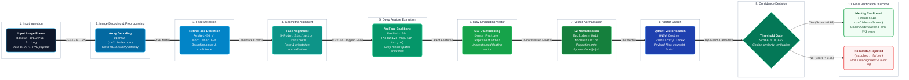

```mermaid
flowchart LR
    %% =========================================================================
    %% STAGE NODES & ANNOTATIONS (HORIZONTAL PIPELINE)
    %% =========================================================================

    subgraph STAGE_IN ["1. Input Ingestion"]
        S1["<b>Input Image Frame</b><br/><code>Base64 JPEG/PNG String</code><br/><i>Data URI / HTTPS payload</i>"]
    end

    subgraph STAGE_PRE ["2. Image Decoding & Preprocessing"]
        S2["<b>Array Decoding</b><br/><code>OpenCV (cv2.imdecode)</code><br/><i>Uint8 RGB NumPy ndarray</i>"]
    end

    subgraph STAGE_DET ["3. Face Detection"]
        S3["<b>RetinaFace Detection</b><br/><code>ResNet-50 / MobileNet FPN</code><br/><i>Bounding boxes & confidence</i>"]
    end

    subgraph STAGE_ALIGN ["4. Geometric Alignment"]
        S4["<b>Face Alignment</b><br/><code>5-Point Similarity Transform</code><br/><i>Pose & orientation normalisation</i>"]
    end

    subgraph STAGE_EXTRACT ["5. Deep Feature Extraction"]
        S5["<b>ArcFace Backbone</b><br/><code>ResNet-100 (Additive Angular Margin)</code><br/><i>Deep metric spatial projection</i>"]
    end

    subgraph STAGE_VEC ["6. Raw Embedding Vector"]
        S6["<b>512-D Embedding</b><br/><code>Dense Feature Representation</code><br/><i>Unconstrained floating vector</i>"]
    end

    subgraph STAGE_NORM ["7. Vector Normalisation"]
        S7["<b>L2 Normalisation</b><br/><code>Euclidean Unit Normalisation</code><br/><i>Projection onto hypersphere ||v||=1</i>"]
    end

    subgraph STAGE_SEARCH ["8. Vector Search"]
        S8["<b>Qdrant Vector Search</b><br/><code>HNSW Cosine Similarity Index</code><br/><i>Payload filter: courseId, limit=1</i>"]
    end

    subgraph STAGE_DECIDE ["9. Confidence Decision"]
        S9{"<b>Threshold Gate</b><br/><code>Score &ge; 0.65?</code><br/><i>Cosine similarity verification</i>"}
    end

    subgraph STAGE_OUT ["10. Final Verification Outcome"]
        S10_PASS["<b>Identity Confirmed</b><br/><code>{studentId, confidenceScore}</code><br/><i>Commit attendance & emit WS event</i>"]
        S10_FAIL["<b>No Match / Rejected</b><br/><code>{matched: false}</code><br/><i>Emit 'unrecognised' & audit log</i>"]
    end

    %% =========================================================================
    %% PIPELINE CONNECTIONS
    %% =========================================================================
    S1 ==>|"REST / HTTPS"| S2
    S2 ==>|"RGB Matrix"| S3
    S3 ==>|"Landmark Coords"| S4
    S4 ==>|"112x112 Cropped Face"| S5
    S5 ==>|"Latent Features"| S6
    S6 ==>|"Un-normalised Float32"| S7
    S7 ==>|"Unit Vector"| S8
    S8 ==>|"Top Match Candidate"| S9

    S9 -->|"Yes (Score &ge; 0.65)"| S10_PASS
    S9 -->|"No (Score < 0.65)"| S10_FAIL

    %% =========================================================================
    %% BLUE-TO-GREEN GRADIENT STYLING (LEFT TO RIGHT)
    %% =========================================================================
    classDef col1 fill:#0f172a,stroke:#38bdf8,stroke-width:2px,color:#ffffff,rx:8px,ry:8px;
    classDef col2 fill:#0369a1,stroke:#0ea5e9,stroke-width:2px,color:#ffffff,rx:8px,ry:8px;
    classDef col3 fill:#0284c7,stroke:#38bdf8,stroke-width:2px,color:#ffffff,rx:8px,ry:8px;
    classDef col4 fill:#0d9488,stroke:#2dd4bf,stroke-width:2px,color:#ffffff,rx:8px,ry:8px;
    classDef col5 fill:#059669,stroke:#34d399,stroke-width:2px,color:#ffffff,rx:8px,ry:8px;
    classDef col6 fill:#16a34a,stroke:#4ade80,stroke-width:2px,color:#ffffff,rx:8px,ry:8px;
    classDef col7 fill:#15803d,stroke:#86efac,stroke-width:2px,color:#ffffff,rx:8px,ry:8px;
    classDef col8 fill:#1e40af,stroke:#60a5fa,stroke-width:2px,color:#ffffff,rx:8px,ry:8px;
    classDef col9 fill:#047857,stroke:#6ee7b7,stroke-width:2px,color:#ffffff,rx:8px,ry:8px;
    classDef passStyle fill:#f0fdf4,stroke:#16a34a,stroke-width:2.5px,color:#14532d,rx:8px,ry:8px;
    classDef failStyle fill:#fef2f2,stroke:#ef4444,stroke-width:2.5px,color:#7f1d1d,rx:8px,ry:8px;
    classDef boxStyle fill:#ffffff,stroke:#94a3b8,stroke-width:1px,color:#0f172a;

    class S1 col1;
    class S2 col2;
    class S3 col3;
    class S4 col4;
    class S5 col5;
    class S6 col6;
    class S7 col7;
    class S8 col8;
    class S9 col9;
    class S10_PASS passStyle;
    class S10_FAIL failStyle;
    class STAGE_IN,STAGE_PRE,STAGE_DET,STAGE_ALIGN,STAGE_EXTRACT,STAGE_VEC,STAGE_NORM,STAGE_SEARCH,STAGE_DECIDE,STAGE_OUT boxStyle;
```
