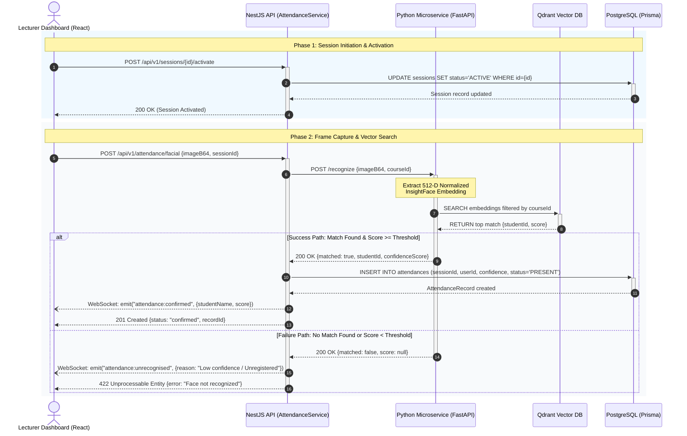

```mermaid
sequenceDiagram
    autonumber
    
    %% =========================================================================
    %% PARTICIPANTS / LIFELINES (Left to Right)
    %% =========================================================================
    actor LD as Lecturer Dashboard (React)
    participant NEST as NestJS API (AttendanceService)
    participant PY as Python Microservice (FastAPI)
    participant QDRANT as Qdrant Vector DB
    participant PG as PostgreSQL (Prisma)

    %% =========================================================================
    %% PHASE 1: SESSION ACTIVATION
    %% =========================================================================
    rect rgb(240, 249, 255)
        Note over LD, PG: Phase 1: Session Initiation & Activation
        LD ->>+ NEST: POST /api/v1/sessions/{id}/activate
        NEST ->>+ PG: UPDATE sessions SET status='ACTIVE' WHERE id={id}
        PG -->>- NEST: Session record updated
        NEST -->>- LD: 200 OK (Session Activated)
    end

    %% =========================================================================
    %% PHASE 2: BIOMETRIC RECOGNITION & VERIFICATION
    %% =========================================================================
    rect rgb(248, 250, 252)
        Note over LD, PG: Phase 2: Frame Capture & Vector Search
        LD ->>+ NEST: POST /api/v1/attendance/facial {imageB64, sessionId}
        NEST ->>+ PY: POST /recognize {imageB64, courseId}
        
        Note over PY: Extract 512-D Normalized<br/>InsightFace Embedding
        PY ->>+ QDRANT: SEARCH embeddings filtered by courseId
        QDRANT -->>- PY: RETURN top match {studentId, score}

        %% =====================================================================
        %% ALTERNATIVE FRAME (SUCCESS VS FAILURE)
        %% =====================================================================
        alt Success Path: Match Found & Score >= Threshold
            PY -->> NEST: 200 OK {matched: true, studentId, confidenceScore}
            NEST ->>+ PG: INSERT INTO attendances (sessionId, userId, confidence, status='PRESENT')
            PG -->>- NEST: AttendanceRecord created
            
            %% Real-time Broadcast & API Response
            NEST --) LD: WebSocket: emit("attendance:confirmed", {studentName, score})
            NEST -->> LD: 201 Created {status: "confirmed", recordId}

        else Failure Path: No Match Found or Score < Threshold
            PY -->>- NEST: 200 OK {matched: false, score: null}
            NEST --) LD: WebSocket: emit("attendance:unrecognised", {reason: "Low confidence / Unregistered"})
            NEST -->>- LD: 422 Unprocessable Entity {error: "Face not recognized"}
        end
    end
```
