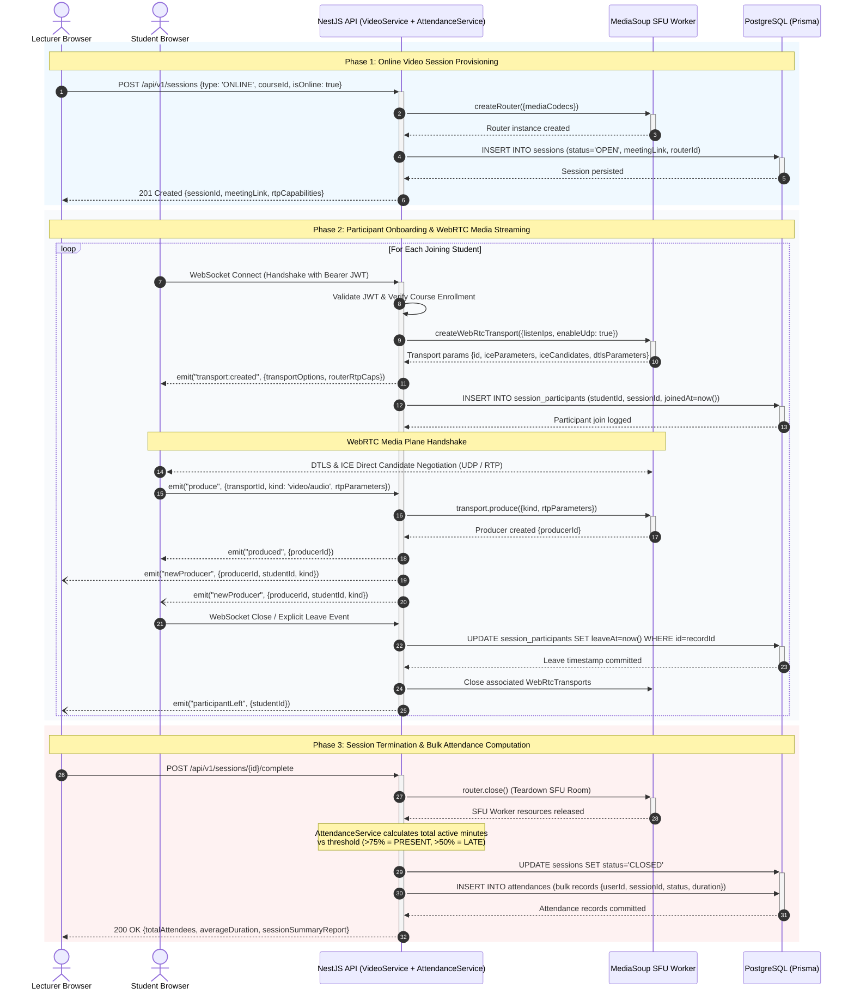

```mermaid
sequenceDiagram
    autonumber

    %% =========================================================================
    %% PARTICIPANTS / LIFELINES (Left to Right)
    %% =========================================================================
    actor LB as Lecturer Browser
    actor SB as Student Browser
    participant NEST as NestJS API (VideoService + AttendanceService)
    participant SFU as MediaSoup SFU Worker
    participant PG as PostgreSQL (Prisma)

    %% =========================================================================
    %% 1. SESSION INITIALIZATION
    %% =========================================================================
    rect rgb(240, 249, 255)
        Note over LB, PG: Phase 1: Online Video Session Provisioning
        LB ->>+ NEST: POST /api/v1/sessions {type: 'ONLINE', courseId, isOnline: true}
        NEST ->>+ SFU: createRouter({mediaCodecs})
        SFU -->>- NEST: Router instance created
        NEST ->>+ PG: INSERT INTO sessions (status='OPEN', meetingLink, routerId)
        PG -->>- NEST: Session persisted
        NEST -->>- LB: 201 Created {sessionId, meetingLink, rtpCapabilities}
    end

    %% =========================================================================
    %% 2. MULTI-STUDENT JOINING & WEBRTC MEDIA PLANE (LOOP)
    %% =========================================================================
    rect rgb(248, 250, 252)
        Note over LB, PG: Phase 2: Participant Onboarding & WebRTC Media Streaming
        
        loop For Each Joining Student
            SB ->>+ NEST: WebSocket Connect (Handshake with Bearer JWT)
            NEST ->> NEST: Validate JWT & Verify Course Enrollment
            
            %% WebRTC Transport Setup
            NEST ->>+ SFU: createWebRtcTransport({listenIps, enableUdp: true})
            SFU -->>- NEST: Transport params {id, iceParameters, iceCandidates, dtlsParameters}
            NEST -->> SB: emit("transport:created", {transportOptions, routerRtpCaps})
            
            %% Audit Log Participant Join
            NEST ->>+ PG: INSERT INTO session_participants (studentId, sessionId, joinedAt=now())
            PG -->>- NEST: Participant join logged

            %% WebRTC Media Plane DTLS / ICE Handshake
            Note over SB, SFU: WebRTC Media Plane Handshake
            SB <<-->> SFU: DTLS & ICE Direct Candidate Negotiation (UDP / RTP)

            %% Produce Tracks (Camera / Mic)
            SB ->> NEST: emit("produce", {transportId, kind: 'video/audio', rtpParameters})
            NEST ->>+ SFU: transport.produce({kind, rtpParameters})
            SFU -->>- NEST: Producer created {producerId}
            NEST -->> SB: emit("produced", {producerId})

            %% Consume Tracks for Other Participants
            NEST --) LB: emit("newProducer", {producerId, studentId, kind})
            NEST --) SB: emit("newProducer", {producerId, studentId, kind})

            %% Student Departure / Disconnection
            SB ->> NEST: WebSocket Close / Explicit Leave Event
            NEST ->>+ PG: UPDATE session_participants SET leaveAt=now() WHERE id=recordId
            PG -->>- NEST: Leave timestamp committed
            NEST ->> SFU: Close associated WebRtcTransports
            NEST --) LB: emit("participantLeft", {studentId})
            deactivate NEST
        end
    end

    %% =========================================================================
    %% 3. SESSION COMPLETION & AUTOMATIC ATTENDANCE CALCULATION
    %% =========================================================================
    rect rgb(254, 242, 242)
        Note over LB, PG: Phase 3: Session Termination & Bulk Attendance Computation
        LB ->>+ NEST: POST /api/v1/sessions/{id}/complete
        NEST ->>+ SFU: router.close() (Teardown SFU Room)
        SFU -->>- NEST: SFU Worker resources released

        %% Bulk Duration & Attendance Computation
        Note over NEST: AttendanceService calculates total active minutes<br/>vs threshold (>75% = PRESENT, >50% = LATE)
        NEST ->>+ PG: UPDATE sessions SET status='CLOSED'
        NEST ->> PG: INSERT INTO attendances (bulk records {userId, sessionId, status, duration})
        PG -->>- NEST: Attendance records committed

        NEST -->>- LB: 200 OK {totalAttendees, averageDuration, sessionSummaryReport}
    end
```
