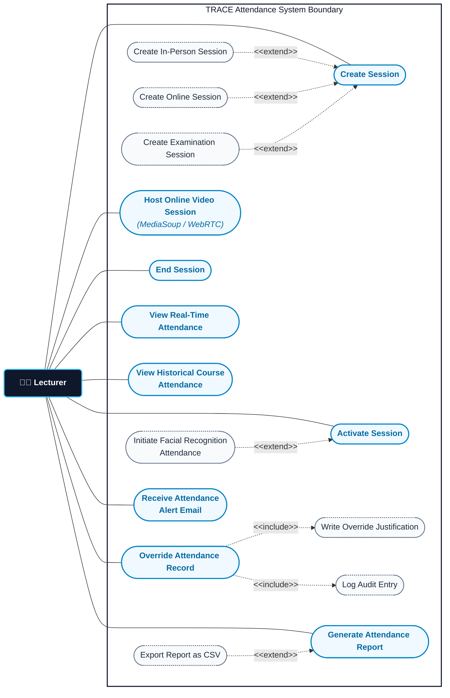

```mermaid
flowchart LR
    %% =========================================================================
    %% ACTOR
    %% =========================================================================
    LECTURER["👨‍🏫 <b>Lecturer</b>"]

    %% =========================================================================
    %% SYSTEM BOUNDARY
    %% =========================================================================
    subgraph SYSTEM_BOUNDARY ["TRACE Attendance System Boundary"]
        
        %% (1) Create Session & Extended Sub-cases
        UC_CREATE_SESS(["<b>Create Session</b>"])
        UC_INPERSON(["Create In-Person Session"])
        UC_ONLINE(["Create Online Session"])
        UC_EXAM(["Create Examination Session"])

        %% (2) Activate Session & (3) Facial Recognition
        UC_ACTIVATE_SESS(["<b>Activate Session</b>"])
        UC_FACIAL_ATTEND(["Initiate Facial Recognition<br/>Attendance"])

        %% (4) Host Online Video Session
        UC_HOST_VIDEO(["<b>Host Online Video Session</b><br/><i>(MediaSoup / WebRTC)</i>"])

        %% (5) End Session
        UC_END_SESS(["<b>End Session</b>"])

        %% (6) & (7) View Attendance Records
        UC_VIEW_REALTIME(["<b>View Real-Time Attendance</b>"])
        UC_VIEW_HISTORICAL(["<b>View Historical Course<br/>Attendance</b>"])

        %% (8) Override Attendance Record & Includes
        UC_OVERRIDE_ATTEND(["<b>Override Attendance Record</b>"])
        UC_WRITE_JUSTIF(["Write Override Justification"])
        UC_LOG_AUDIT(["Log Audit Entry"])

        %% (9) & (10) Reports
        UC_GEN_REPORT(["<b>Generate Attendance Report</b>"])
        UC_EXPORT_CSV(["Export Report as CSV"])

        %% (11) Alert Email
        UC_RECEIVE_ALERT(["<b>Receive Attendance<br/>Alert Email</b>"])

    end

    %% =========================================================================
    %% ACTOR ASSOCIATIONS
    %% =========================================================================
    LECTURER --- UC_CREATE_SESS
    LECTURER --- UC_ACTIVATE_SESS
    LECTURER --- UC_HOST_VIDEO
    LECTURER --- UC_END_SESS
    LECTURER --- UC_VIEW_REALTIME
    LECTURER --- UC_VIEW_HISTORICAL
    LECTURER --- UC_OVERRIDE_ATTEND
    LECTURER --- UC_GEN_REPORT
    LECTURER --- UC_RECEIVE_ALERT

    %% =========================================================================
    %% <<extend>> STEREOTYPES (Session Creation Specializations)
    %% =========================================================================
    UC_INPERSON -.->|"&lt;&lt;extend&gt;&gt;"| UC_CREATE_SESS
    UC_ONLINE -.->|"&lt;&lt;extend&gt;&gt;"| UC_CREATE_SESS
    UC_EXAM -.->|"&lt;&lt;extend&gt;&gt;"| UC_CREATE_SESS

    %% =========================================================================
    %% <<extend>> STEREOTYPES (Facial Recognition & CSV Export)
    %% =========================================================================
    UC_FACIAL_ATTEND -.->|"&lt;&lt;extend&gt;&gt;"| UC_ACTIVATE_SESS
    UC_EXPORT_CSV -.->|"&lt;&lt;extend&gt;&gt;"| UC_GEN_REPORT

    %% =========================================================================
    %% <<include>> STEREOTYPES (Override Attendance Record)
    %% =========================================================================
    UC_OVERRIDE_ATTEND -.->|"&lt;&lt;include&gt;&gt;"| UC_WRITE_JUSTIF
    UC_OVERRIDE_ATTEND -.->|"&lt;&lt;include&gt;&gt;"| UC_LOG_AUDIT

    %% =========================================================================
    %% ACADEMIC TWO-TONE UML STYLING
    %% =========================================================================
    classDef actorStyle fill:#0f172a,stroke:#38bdf8,stroke-width:2px,color:#ffffff,rx:6px,ry:6px;
    classDef mainUcStyle fill:#f0f9ff,stroke:#0284c7,stroke-width:2px,color:#0369a1;
    classDef subUcStyle fill:#f8fafc,stroke:#64748b,stroke-width:1.5px,color:#1e293b,stroke-dasharray: 2 2;
    classDef systemStyle fill:#ffffff,stroke:#0f172a,stroke-width:2px,color:#0f172a;

    class LECTURER actorStyle;
    class UC_CREATE_SESS,UC_ACTIVATE_SESS,UC_HOST_VIDEO,UC_END_SESS,UC_VIEW_REALTIME,UC_VIEW_HISTORICAL,UC_OVERRIDE_ATTEND,UC_GEN_REPORT,UC_RECEIVE_ALERT mainUcStyle;
    class UC_INPERSON,UC_ONLINE,UC_EXAM,UC_FACIAL_ATTEND,UC_WRITE_JUSTIF,UC_LOG_AUDIT,UC_EXPORT_CSV subUcStyle;
    class SYSTEM_BOUNDARY systemStyle;
```
