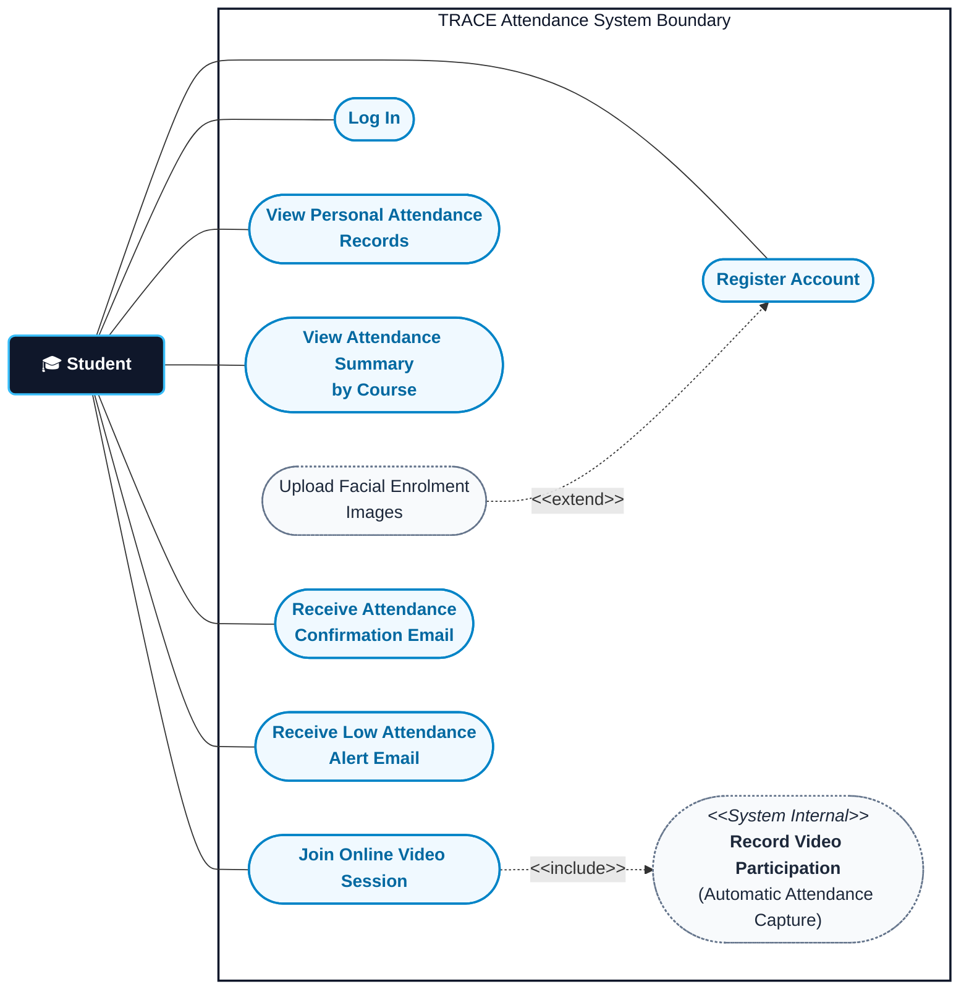

```mermaid
flowchart LR
    %% =========================================================================
    %% ACTOR
    %% =========================================================================
    STUDENT["🎓 <b>Student</b>"]

    %% =========================================================================
    %% SYSTEM BOUNDARY
    %% =========================================================================
    subgraph SYSTEM_BOUNDARY ["TRACE Attendance System Boundary"]
        
        %% (1) & (2) Registration & Facial Enrolment
        UC_REGISTER(["<b>Register Account</b>"])
        UC_UPLOAD_FACE(["Upload Facial Enrolment<br/>Images"])

        %% (3) Authentication
        UC_LOGIN(["<b>Log In</b>"])

        %% (4) & (5) Attendance Views
        UC_VIEW_PERSONAL(["<b>View Personal Attendance<br/>Records</b>"])
        UC_VIEW_SUMMARY(["<b>View Attendance Summary<br/>by Course</b>"])

        %% (6) & Internal Attendance Capture
        UC_JOIN_VIDEO(["<b>Join Online Video Session</b>"])
        UC_RECORD_PARTICIPATION(["<i>&lt;&lt;System Internal&gt;&gt;</i><br/><b>Record Video Participation</b><br/>(Automatic Attendance Capture)"])

        %% (7) & (8) Notifications & Alerts
        UC_CONFIRM_EMAIL(["<b>Receive Attendance<br/>Confirmation Email</b>"])
        UC_LOW_ATTEND_ALERT(["<b>Receive Low Attendance<br/>Alert Email</b>"])

    end

    %% =========================================================================
    %% ACTOR ASSOCIATIONS
    %% =========================================================================
    STUDENT --- UC_REGISTER
    STUDENT --- UC_LOGIN
    STUDENT --- UC_VIEW_PERSONAL
    STUDENT --- UC_VIEW_SUMMARY
    STUDENT --- UC_JOIN_VIDEO
    STUDENT --- UC_CONFIRM_EMAIL
    STUDENT --- UC_LOW_ATTEND_ALERT

    %% =========================================================================
    %% <<extend>> STEREOTYPE (Biometric Onboarding)
    %% =========================================================================
    UC_UPLOAD_FACE -.->|"&lt;&lt;extend&gt;&gt;"| UC_REGISTER

    %% =========================================================================
    %% <<include>> STEREOTYPE (Automatic Video Attendance Capture)
    %% =========================================================================
    UC_JOIN_VIDEO -.->|"&lt;&lt;include&gt;&gt;"| UC_RECORD_PARTICIPATION

    %% =========================================================================
    %% ACADEMIC TWO-TONE UML STYLING
    %% =========================================================================
    classDef actorStyle fill:#0f172a,stroke:#38bdf8,stroke-width:2px,color:#ffffff,rx:6px,ry:6px;
    classDef mainUcStyle fill:#f0f9ff,stroke:#0284c7,stroke-width:2px,color:#0369a1;
    classDef subUcStyle fill:#f8fafc,stroke:#64748b,stroke-width:1.5px,color:#1e293b,stroke-dasharray: 2 2;
    classDef systemStyle fill:#ffffff,stroke:#0f172a,stroke-width:2px,color:#0f172a;

    class STUDENT actorStyle;
    class UC_REGISTER,UC_LOGIN,UC_VIEW_PERSONAL,UC_VIEW_SUMMARY,UC_JOIN_VIDEO,UC_CONFIRM_EMAIL,UC_LOW_ATTEND_ALERT mainUcStyle;
    class UC_UPLOAD_FACE,UC_RECORD_PARTICIPATION subUcStyle;
    class SYSTEM_BOUNDARY systemStyle;
```
