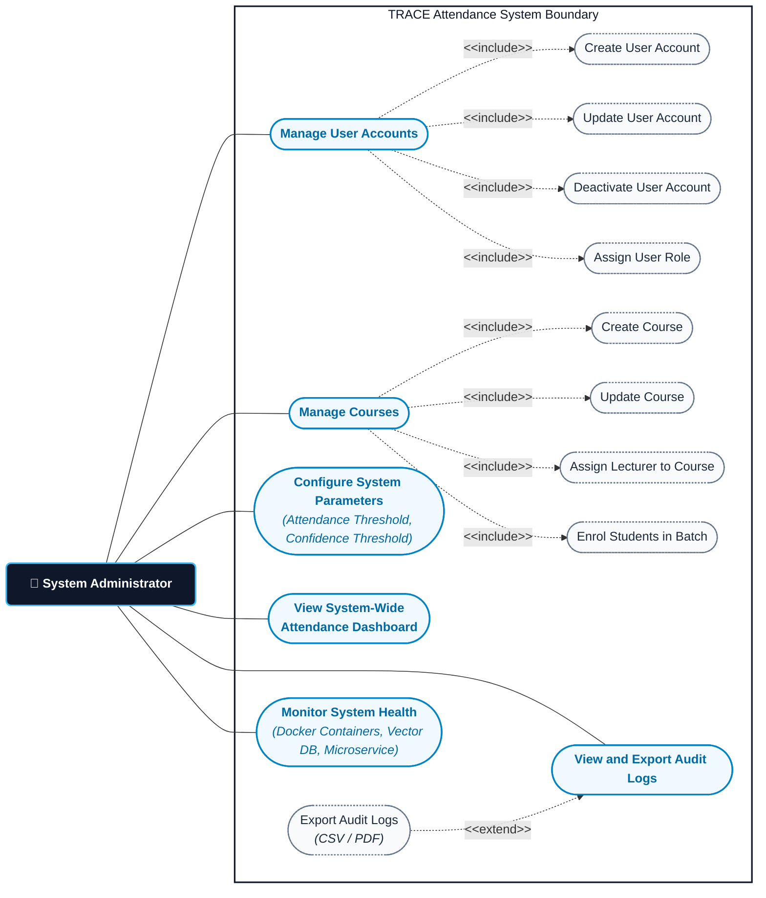

```mermaid
flowchart LR
    %% =========================================================================
    %% ACTOR
    %% =========================================================================
    ADMIN["👤 <b>System Administrator</b>"]

    %% =========================================================================
    %% SYSTEM BOUNDARY
    %% =========================================================================
    subgraph SYSTEM_BOUNDARY ["TRACE Attendance System Boundary"]
        
        %% (1) Manage User Accounts & Included Use Cases
        UC1(["<b>Manage User Accounts</b>"])
        UC1_1(["Create User Account"])
        UC1_2(["Update User Account"])
        UC1_3(["Deactivate User Account"])
        UC1_4(["Assign User Role"])

        %% (2) Manage Courses & Included Use Cases
        UC2(["<b>Manage Courses</b>"])
        UC2_1(["Create Course"])
        UC2_2(["Update Course"])
        UC2_3(["Assign Lecturer to Course"])
        UC2_4(["Enrol Students in Batch"])

        %% (3) Configure System Parameters
        UC3(["<b>Configure System Parameters</b><br/><i>(Attendance Threshold, Confidence Threshold)</i>"])

        %% (4) View System-Wide Attendance Dashboard
        UC4(["<b>View System-Wide<br/>Attendance Dashboard</b>"])

        %% (5) View and Export Audit Logs
        UC5(["<b>View and Export Audit Logs</b>"])
        UC5_1(["Export Audit Logs<br/><i>(CSV / PDF)</i>"])

        %% (6) Monitor System Health
        UC6(["<b>Monitor System Health</b><br/><i>(Docker Containers, Vector DB, Microservice)</i>"])

    end

    %% =========================================================================
    %% ACTOR ASSOCIATIONS
    %% =========================================================================
    ADMIN --- UC1
    ADMIN --- UC2
    ADMIN --- UC3
    ADMIN --- UC4
    ADMIN --- UC5
    ADMIN --- UC6

    %% =========================================================================
    %% <<include>> STEREOTYPES (Manage User Accounts)
    %% =========================================================================
    UC1 -.->|"&lt;&lt;include&gt;&gt;"| UC1_1
    UC1 -.->|"&lt;&lt;include&gt;&gt;"| UC1_2
    UC1 -.->|"&lt;&lt;include&gt;&gt;"| UC1_3
    UC1 -.->|"&lt;&lt;include&gt;&gt;"| UC1_4

    %% =========================================================================
    %% <<include>> STEREOTYPES (Manage Courses)
    %% =========================================================================
    UC2 -.->|"&lt;&lt;include&gt;&gt;"| UC2_1
    UC2 -.->|"&lt;&lt;include&gt;&gt;"| UC2_2
    UC2 -.->|"&lt;&lt;include&gt;&gt;"| UC2_3
    UC2 -.->|"&lt;&lt;include&gt;&gt;"| UC2_4

    %% =========================================================================
    %% <<extend>> STEREOTYPES (Audit Logs)
    %% =========================================================================
    UC5_1 -.->|"&lt;&lt;extend&gt;&gt;"| UC5

    %% =========================================================================
    %% ACADEMIC TWO-TONE UML STYLING
    %% =========================================================================
    classDef actorStyle fill:#0f172a,stroke:#38bdf8,stroke-width:2px,color:#ffffff,rx:6px,ry:6px;
    classDef mainUcStyle fill:#f0f9ff,stroke:#0284c7,stroke-width:2px,color:#0369a1;
    classDef subUcStyle fill:#f8fafc,stroke:#64748b,stroke-width:1.5px,color:#1e293b,stroke-dasharray: 2 2;
    classDef systemStyle fill:#ffffff,stroke:#0f172a,stroke-width:2px,color:#0f172a;

    class ADMIN actorStyle;
    class UC1,UC2,UC3,UC4,UC5,UC6 mainUcStyle;
    class UC1_1,UC1_2,UC1_3,UC1_4,UC2_1,UC2_2,UC2_3,UC2_4,UC5_1 subUcStyle;
    class SYSTEM_BOUNDARY systemStyle;
```
